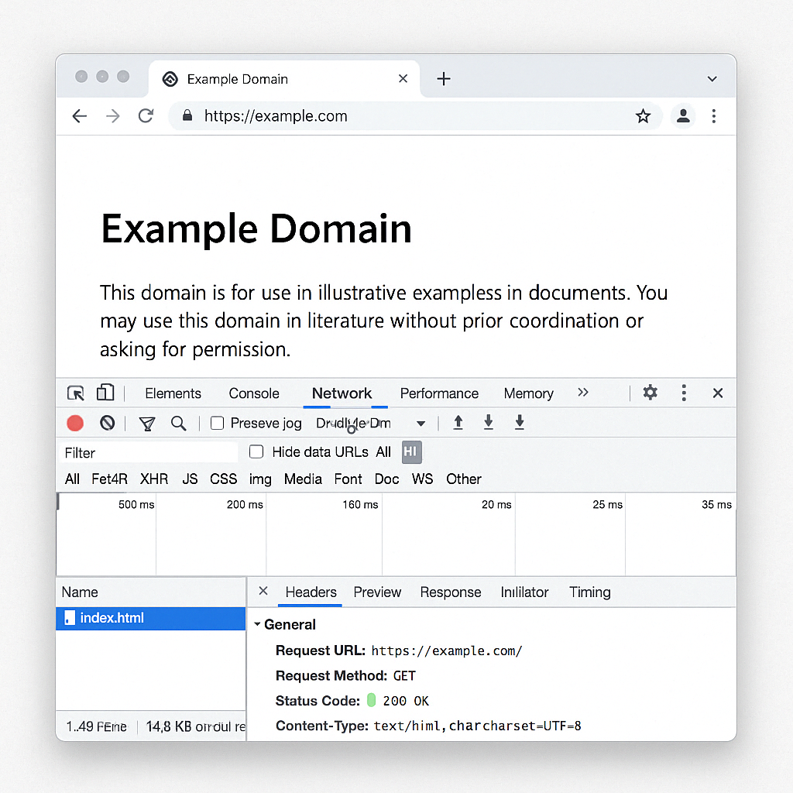

# Introduction to HTTP

HTTP stands for **HyperText Transfer Protocol**. HTTP is a protocol, meaning a set of rules that allows browsers and servers to communicate effectively by establishing how something is requested, how it is responded to, and what the structure of that exchange (request + response) should look like. Although it often goes unnoticed, it is the central mechanism behind every interaction on the web.

When you type a web address (like `https://www.wikipedia.org`) and press Enter:

1. Your browser sends an **HTTP request** to the server hosting that page.
2. The server processes the request and responds with an **HTTP response**, which includes:
    - A status code (like 200, 404, etc.)
    - Headers (technical information)
    - And most importantly, the **requested content** (e.g., an HTML file).

This request/response cycle repeats constantly as we browse, making the web work in real time.

Below, you can observe the HTTP cycle in action: from the moment you type a **URL** to when the browser receives and processes the response. The following image demonstrates how to use browser tools to view the technical details of a real request in this example:

1. Access `https://example.com`.
2. Open the inspector (`F12`) and select the `Network` tab.
3. Reload the page to record the request.
4. Click on `index.html` to view details such as:

    - The request method (GET)
    - The status code (200 OK)
    - The headers sent and received
    - The content type (Content-Type: text/html)

This type of inspection is key to understanding how information flows between the browser and the server.

### Does HTTP Format Content?

Here’s where a fundamental distinction arises: **HTTP does not interpret or format the content it transports**. Its role is simply to **deliver data from the server to the browser** following precise communication rules.

We can think of it as **a postal envelope**:

- It defines how to write the address, how to package the content, how the letter should travel, and how it should be delivered.
- The content can be anything: a love letter, a contract, a recipe, or a photo.
- The envelope reaches its destination, but **it does not modify what’s inside**, nor does it try to understand it. It just delivers it.

Similarly, HTTP can transport:
- HTML pages (`text/html`)
- CSS styles (`text/css`)
- JavaScript scripts (`application/javascript`)
- Multimedia files (images, videos)
- Data in JSON format (`application/json`)

But it does not interpret, style, or “display” them. That’s the browser’s job, **once it receives the package**.

> That’s why we say **HTTP “has no format”**: it doesn’t care if it’s sending text, an image, or a data file. Its task is to deliver the information in a structured and reliable way, without interfering with its content.

### Content Formats Accepted by the Browser

When the browser receives an HTTP response, it examines the content type through the **`Content-Type` header** and decides how to handle it. Some of the most common formats are:

| Format | MIME Type | Usage |
|--------|-----------|-------|
| `text/html` | HTML | Structure of a web page |
| `text/css` | CSS | Visual styles |
| `application/javascript` | JS | Dynamic behavior |
| `application/json` | JSON | Structured data (common in APIs) |
| `image/png`, `image/jpeg` | Images | Graphic representation |
| `text/plain` | Plain text | Unformatted reading |

The browser **translates this data into a visual experience**: it renders the HTML, applies the CSS styles, executes the JS scripts, and displays images or text. This is how it transforms the “data load” into a functional and interactive page.

## Quick Glossary:
- **HTTP**: Hypertext Transfer Protocol
- **Request**: A browser's request to a server
- **Response**: The server's reply to the browser
- **Status Code**: A code indicating the status of the response (200 = OK, 404 = Not Found)
- **Headers**: Additional technical information accompanying a request or response
